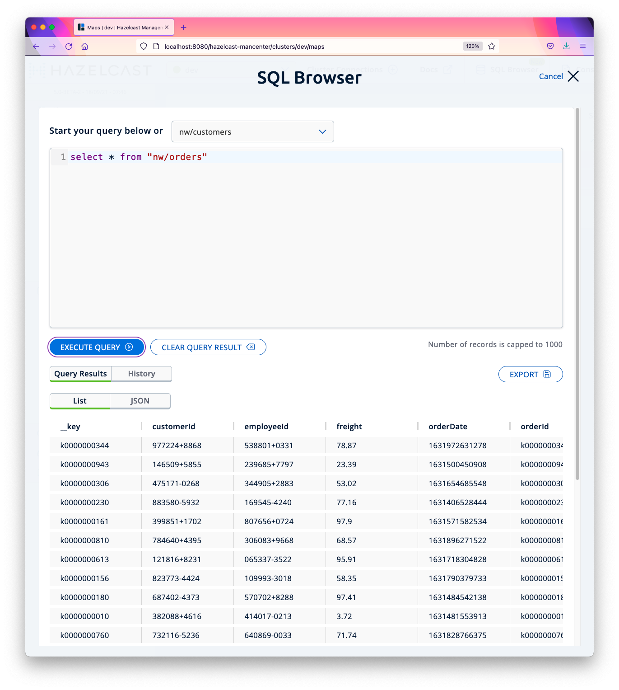
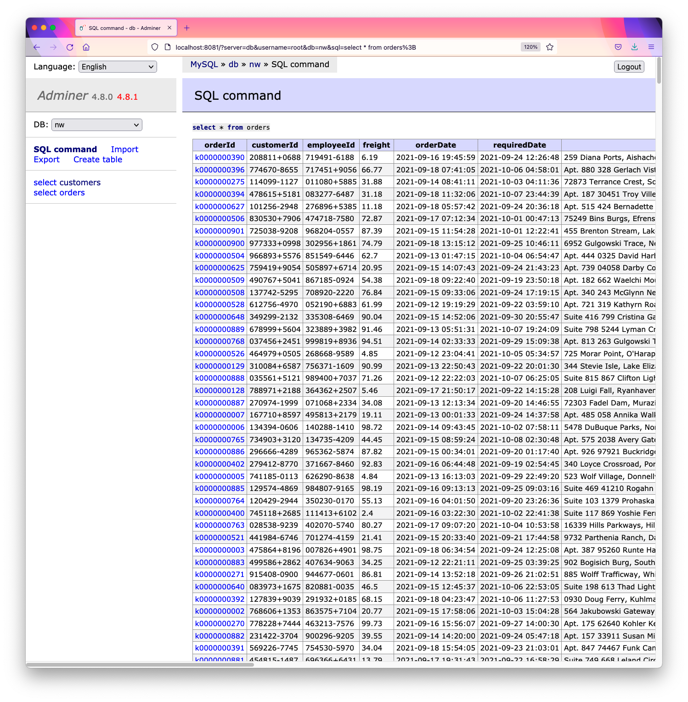

# Bundle: MySQL Sync

This bundle is preconfigured to synchronize Hazelcast with MySQL running as a Docker container. It includes the `db` cluster app to read/write from/to Hazelcast and MySQL. It also includes instructions for replacing MySQL with another database.

## Installing Bundle

```bash
# Current workspace
install_bundle -download bundle-hazelcast-3n4n5-docker-dbsync_mysql

# New workspace: download 
install_bundle -download -workspace bundle-hazelcast-3n4n5-docker-dbsync_mysql

# New workspace: checkout
install_bundle -checkout bundle-hazelcast-3n4n5-docker-dbsync_mysql
```

## Use Case

The client applications read/write from/to Hazelcast which in turn read/write from/to a database. The database is used as the persistent store and Hazelcast as the bidirectional cache-aside store. The Hazelcast maps are configured with the LFU eviction policy to evict entries if the free heap size falls below 25% of the maximum heap size. This ensures the Hazelcast cluster will have at least 25% of free memory at all time which is necessary for executing distributed operations such as query and task executions.


## Bundle Contents

```console
clusters
└── db

docker
└── dbsync_mysql
```

## Configuring Bundle Environment

### MySQL

The `db` cluster has been preconfigured to connect to MySQL on localhost with the user name `root` and the password `password`. If you need to change user name and password, edit `etc/hibernate.cfg-mysql.xml`.

```console
switch_cluster db
vi etc/hibernate.cfg-mysql.xml
```

### Create and build `perf_test_db`

We will use the `perf_test` app included in PadoGrid to ingest data into the Hazelcast cluster.

```bash
# Create perf_test with the name 'perf_test_db'
create_app -name perf_test_db

# We need to download the MySQL binary files by building `perf_test_db` as follows.
cd_app perf_test_db; cd bin_sh
./build_app
```

## Startup Sequence

```bash
# 1. Add at least two (2) members to the `db` cluster. All bundles come without members.
switch_cluster db
add_member; add_member

# 2. Run the cluster.
start_cluster

# 3. Monitor the log file. Hibernate has been configured to log SQL statements
#    executed by the MapStorePkDbImpl plugin.
show_log

# 4. Open another terminal and launch Docker Compose.
cd_docker dbsync_mysql
docker-compose up
```

5. The Docker Compose environment includes *Adminer*. Open it in the browser and add the **nw** database in which we will be syncronizing Hazelcast the `nw/customers` and `nw/orders` maps. When you run the `test_group` script (see below), the `customers` and `orders` tables will automatically be created in the `nw` database by Hibernate invoked by the `MapStorePkDbImpl` plugin.

Adminer URL: http://localhost:8081

```console
Username: root
Password: password
Database to create: nw
```


6. Ingest data

The `test_group` script creates mock data for `Customer` and `Order` objects and ingests them into the Hazelcast cluster which in turn writes to MySQL via the `MapStorePkDbImpl` plugin included in the PadoGrid distribution. The same plugin is also registered to retrieve data from MySQL for cache misses in the cluster.

```bash
cd_app perf_test_db; cd bin_sh
./test_group -prop ../etc/group-factory.properties -run
```

You should see SQL statements being logged if you are running `show_log`.

7. Management Center

You can use the Management Center to view the ingested data.

```bash
start_mc
```

URL: http://localhost:8080/hazelcast-mancenter

Using the SQL Browser, execute the following queries.

```sql
select * from "nw/customers";
select * from "nw/orders";
```



8. Adminer

From Adminer, execute the following queries.

```sql
select * from customers;
select * from orders;
```



## Replacing MySQL with Another Database

If you have a database other than MySQL then you need to download the appropriate JDBC driver and update the Hibernate configuration file. The JDBC driver can be downloaded by adding the database dependency in the `pom.xml` file in the `perf_test_db` directory and run the `build_app` command as shown below.

```bash
cd_app perf_test_db
vi pom.xml
```

The following shows the PostgresSQL dependency that is already included in the `pom.xml` file.

```xml
<!-- https://mvnrepository.com/artifact/org.postgresql/postgresql -->
<dependency>
   <groupId>org.postgresql</groupId>
   <artifactId>postgresql</artifactId>
   <version>42.2.8</version>
</dependency>
```

Build the app. The `build_app` command downloads your JDBC driver and automatically deploys it to the `$PADOGRID_WORKSPACE/lib` directory.

```bash
cd bin_sh
./build_app
```

Configure Hibernate. Copy the `etc/hibernate.cfg-mysql.xml` file in the cluster directory to a file with another name, e.g., `hibernate.cfg-mydb.xml` and include the driver and login information in the new file.

```bash
cd_cluster
cp etc/hibernate.cfg-mysql.xml etc/hibernate.cfg-mydb.xml
vi etc/hibernate.cfg-mydb.xml
```

Set the cluster to the new Hibernate configuration file. Edit `bin_sh/setenv.sh` and set the `HIBERNATE_CONFIG_FILE` environment variable to the new Hibernate configuration file name.

```bash
cd_cluster
vi bin_sh/setenv.sh
```

For our example, you would set `HIBERNATE_CONFIG_FILE` in the `bin_sh/setenv.sh` file as follows:

```bash
HIBERNATE_CONFIG_FILE="$CLUSTER_DIR/etc/hibernate.cfg-mydb.xml"
```

## Teardown

```bash
# Stop the cluster.
stop_cluster

# Stop Docker Compose
cd_docker dbsync_mysql
docker-compose down
```
